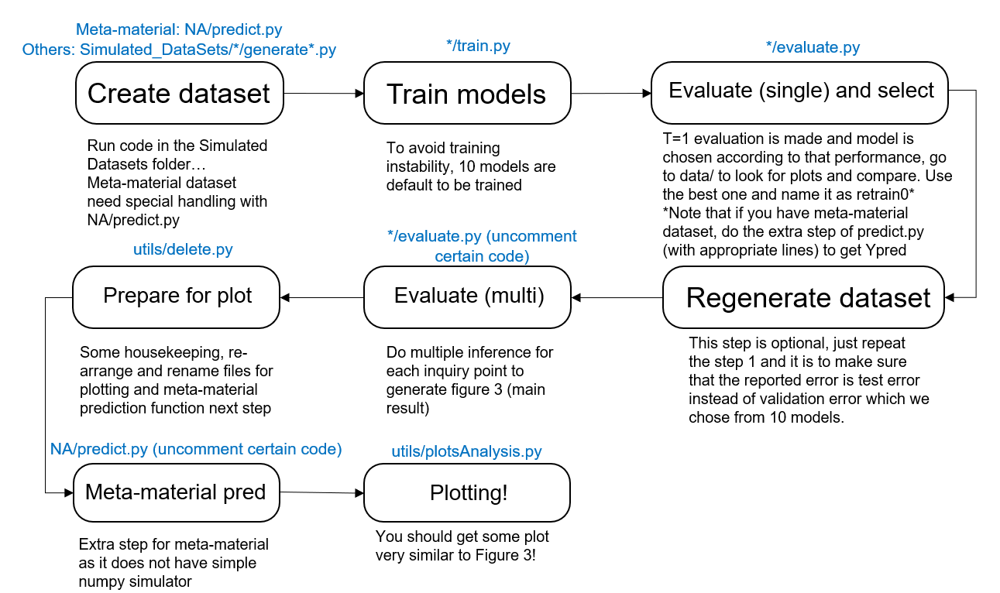
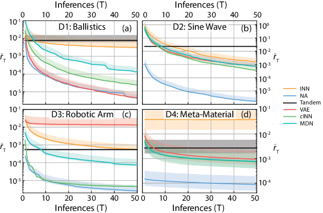

# Benchmarking Deep Inverse Models over time, and the Neural-Adjoint method

[comment]: <This repository is the official implementation of [My Paper Title](https://arxiv.org/abs/2030.12345).> 


## Requirements

### Packages needed:

| Package | Version |
|:---------------------------------------------:|:------------------------------------------------------------------:|
| Python | \>=3.7 |
| Pytorch | \>= 1.3.1 |
| Numpy  | \>=1.17.4 |
| Pandas | \>=0.25.3 |
| Tensorboard | \>=2.0.0 |
| Tqdm| \>=4.42.0 |
| Sklearn | \>=0.22.1|
| Matplotlib | \>= 3.1.3|
|[FrEIA](https://github.com/VLL-HD/FrEIA)  | \>=0.2 | 

We would like to express special thanks to [Visual Learning Lab Heidelberg](https://github.com/VLL-HD) who provided open sourced implementation of their Invertible network structure called Framework for Easily Invertible Architectures (FrEIA) above. We were inspired a lot from their work.

### Environment
1. The detailed conda environment is packaged in [.yml file](./demo/environment_droplet.yml).
2. Add the [Benchmarking Algorithm folder](./Benchmarking%20Algorithms) as one of the source directory to make utils and Simulated_Dataset folders 
visible runtime

### Flow chart process
Individual steps are illustrated below. This is laying the roadmap of how you can recreate the result in our paper. The blue fineprint above each step is the functions you should run and please check the detailed illustration below before you run it. 
 

### Benchmarking datasets

The code to generate the benchmarking dataset can be found in [Simulated_Datasets](./Simulated_DataSets)
For meta-material dataset, see above section for detailed description.
 
### Meta-material Neural simulator
As illustrated in the supplementary material, a ensemble neural simulator has been created for the meta-material dataset
with a high accuracy (mean squared error = 6e-5). The training and testing of the meta-material dataset for benchmarking
performance all depend on this neural simulator. 

The neural simulator is shared by state_dict.pth files (there are 5 models which have the same structure but different weights) in Simulated_DataSets/Meta-material Nerual Simulator/ensemble/state_dicts

To generate dataset for meta-material, first unzip the state-dicts under the same folder and run scipt in [folder](./NA).

The reason why the mm data creation is in the NA is that we are using the forward model nature of NA here.
```create_mm_dataset
python predict.py  (Make sure you have the one line says creat_mm_dataset activated in this file)
```

The generated file called "MM_data_full.csv" is the Meta-material data that you should read for further training and\
 is regarded as the ground truth for next stages. Move the file to dataIn/ folder (as the only file in the folder).

## Training

To train the models in the paper, go to the each folders for algorithms,
 run this command:

```train
python train.py 
```

> This would read the flags.obj file in the 'models' folder to retrieve the hyper-parameters for each of the
> datasets, afterwhich a training process would be initiated to train a network described in Section 4 of main paper.
> 
> The trained models would be placed in the same 'models' folder with training time and checkpoint file produced.
> Currently the 'models' folders contains the trained hyper-parameters 
> 
> To counter the stochastic nature of the neural network training process, the training is done 10 times (set up already) and make sure you use the evaluation code below to evaluate and get a good model instead of one stuck in local minimum that gives bad performance

## Evaluation

To evaluate the models, for each of the algorithms, run this command:
```eval
python evaluate.py
```

> This would read the flags.obj and best_model.pt file from the 'models' folder and write the evaluation data.
> Note that since we are benchmarking and comparing the time-performance trade-off of various networks structures,
> for a single query data point, multiple trails (200) would be run and each trail would get a different inverse 
> solution (except for Tandem model which is deterministic) as depicted in Fig 3 in main paper.
>
> The function evaluate.py has multiple options (all documented) and one can use different combination of them to test 
> experiment relevant to the applicaiton. Currently the code is prepared to evaluate all the dataset with all 10 training instance for single point evaluation (single point means each algorithm gets 1 chance to provide an inverse answer to a inquiry y point where multi_eval means each algorithm gets multiple chances for each inquiry y and best accuracy is selected. 
> 
> The evaluation results would be stored at the "data/" folder in current directory with plot of the histogram of the MSE. You can change the number of inference point (test set ratio) in code "utils/evaluation_helper/get_test_ratio_helper".
> There are generally 2 modes of evaluation, the single evaluation to determine whether you have a good model trained and another multi_eval mode where the various T values are used and compare to see how efficiently these methods explore the solution space. You would find revelant documentation there.
> One special thing to mention is that for meta-material dataset, since there is no closed form "Simulator", we would run the neural simulator again just like in meta-material dataset creation step. After you run evaluation, simply go to NA/ folder and run the predict.py with relevant code at __main__ function.
> After comparing the 10 instance of training and selecting the best performing one, modify the code in predict.py function "evaluate_different_dataset" line 3: for j in range(10) to become only evaluating the best one you choosed from for next step.
> If the previous step of using validation performance as test set performance bothers you, feel free to run the data generation code again to get a new set of "unseen" data. Our experience is that only selecting from 10 training instance with the same hyper-parameter does not cause significant validation set overfitting and therefore we did not make this default choice here.

## Comparing the efficiency of the algorithms

To compare the efficiency of the algorithms on exploring the solution space, we proposed R_t metric which resembles the top_k_accuracy in computer vision task in inverse problem. To get the results of our paper figure 3, run the multi_evaluation in the above section for each of the algorithms. By then you would find multi_eval folder full of evalutation files. To do some housekeeping for our code, we need to delete and rename some files, go to multi_eval/ folder and run

```delete
python delete.py
```

Then, if you are using the meta-material dataset, run the predict.py for the meta-material dataset in the NA/ folder to get the Ypred files for meta-material.

You are almost there! Now you have all the evaluation results, to plot them go to utils/ folder and run

```plot
python plotsAnalysis.py
```

to get the plot, which would be located in the multi_eval/ folder. We also provided the 25% 75% as a basic error bar for a visualization of the uncertainty of the methods.  

> One thing to mention is that due to random initialization of weights, local minimums caused by the rough loss surface and stochastic nature of these algorithms, the plot generated is not going to be exactly like the one on the paper. However, with multiple training (mentioned above), the trend is very stable.


## Results

Our model achieves the following performance on :

 


## Contributing

